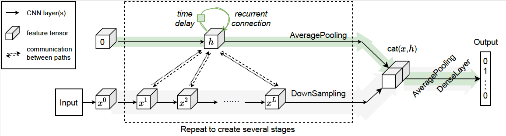
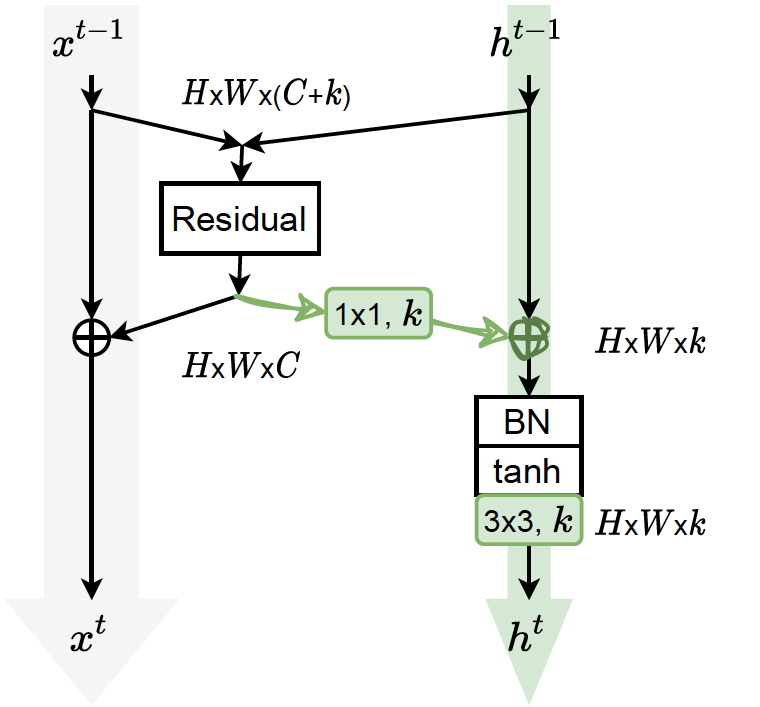

# RLA-Net: Recurrent Layer Aggregation

Recurrence along Depth: Deep Networks with Recurrent Layer Aggregation

This is an implementation of RLA-Net (accept by NeurIPS-2021, [paper](url)).



## Introduction
This paper introduces a concept of layer aggregation to describe how information from previous layers can be reused to better extract features at the current layer. 
While DenseNet is a typical example of the layer aggregation mechanism, its redundancy has been commonly criticized in the literature. 
This motivates us to propose a very light-weighted module, called recurrent layer aggregation (RLA), by making use of the sequential structure of layers in a deep CNN. 
Our RLA module is compatible with many mainstream deep CNNs, including ResNets, Xception and MobileNetV2, and its effectiveness is verified by our extensive experiments on image classification, object detection and instance segmentation tasks. 
Specifically, improvements can be uniformly observed on CIFAR, ImageNet and MS COCO datasets, and the corresponding RLA-Nets can surprisingly boost the performances by 2-3\% on the object detection task. 
This evidences the power of our RLA module in helping main CNNs better learn structural information in images.

## Citation

    @InProceedings{zhao2021rla,
       title={Recurrence along Depth: Deep Networks with Recurrent Layer Aggregation},
       author={Jingyu Zhao, Yanwen Fang and Guodong Li},
       booktitle = {},
       year={2021}
     }

## RLA module

<br/>


## Changelog

- 2021/04/06 Upload RLA-ResNet model.
- 2021/04/16 Upload RLA-MobileNetV2 (depthwise separable conv version) model.
- 2021/09/29 Upload all the ablation study on ImageNet.
- 2021/09/30 Upload mmdetection files.
- 2021/10/01 Upload pretrained weights.

## Installation

### Requirements

- Python 3.5+
- PyTorch 1.0+
- [thop](https://github.com/Lyken17/pytorch-OpCounter)
- [mmdetection](https://github.com/open-mmlab/mmdetection)

### Our environments

- OS: Linux Red Hat 4.8.5
- CUDA: 10.2
- Toolkit: Python 3.8.5, PyTorch 1.7.0, torchvision 0.8.1
- GPU: Tesla V100

Please refer to [get_started.md](docs/get_started.md) for more details about installation.


## Quick Start

### Train with ResNet

#### - Use single node or multi node with multiple GPUs

Use multi-processing distributed training to launch N processes per node, which has N GPUs. This is the fastest way to use PyTorch for either single node or multi node data parallel training.

  ```bash
  python train.py -a {model_name} --b {batch_size} --multiprocessing-distributed --world-size 1 --rank 0 {imagenet-folder with train and val folders}
  ```

#### - Specify single GPU or multiple GPUs

  ```bash
  CUDA_VISIBLE_DEVICES={device_ids} python train.py -a {model_name} --b {batch_size} --multiprocessing-distributed --world-size 1 --rank 0 {imagenet-folder with train and val folders}
  ```

### Testing

To evaluate the best model

  ```bash
  python train.py -a {model_name} --b {batch_size} --multiprocessing-distributed --world-size 1 --rank 0 --resume {path to the best model} -e {imagenet-folder with train and val folders}
  ```

### Visualizing the training result

To generate acc_plot, loss_plot
  ```
  python eval_visual.py --log-dir {log_folder}
  ```
  
### Train with MobileNet_v2

It is same with above ResNet replace `train.py` by `train_light.py`.


### Compute the parameters and FLOPs

If you have install [thop](https://github.com/Lyken17/pytorch-OpCounter), you can `paras_flops.py` to compute the parameters and FLOPs of our models. The usage is below:
```
python paras_flops.py -a {model_name}
```

More examples are shown in [examples.md](docs/examples.md).

### MMDetection


## Experiments

### ImageNet
|Model|Param.|FLOPs|Top-1(%)|Top-5(%)|BaiduDrive(models)|Extract code|GoogleDrive|
|:---:|:----:|:---:|:------:|:------:|:----------------:|:----------:|:---------:|
|ECA-Net18|11.15M|1.70G|70.92|89.93|[eca_resnet18_k3577](https://pan.baidu.com/s/1Bh9J7VY2tYj5oEvEEqvdhQ)|utsy|[eca_resnet18_k3577](https://drive.google.com/open?id=1LMRFRTyzVifGBi2MUpTuYEWW44S8mwyl)|
|ECA-Net34|20.79M|3.43G|74.21|91.83|[eca_resnet34_k3357](https://pan.baidu.com/s/1FFVUBbbJfNNFhyiZZ2P2AQ)|o4dh|[eca_resnet34_k3357](https://drive.google.com/open?id=15LV5Jkea3GPzvLP5__H7Gg88oNQUxBDE)|
|ECA-Net50|24.37M|3.86G|77.42|93.62|[eca_resnet50_k3557](https://pan.baidu.com/s/18LXDcxy8qG66h-7FlWW4SA)|no6u|[eca_resnet50_k3557](https://drive.google.com/open?id=1670rce333c_lyMWFzBlNZoVUvtxbCF_U)|
|ECA-Net101|42.49M|7.35G|78.65|94.34|[eca_resnet101_k3357](https://pan.baidu.com/s/1-ageRP2tku-YSIOqU09WpA)|iov1|[eca_resnet101_k3357](https://drive.google.com/open?id=1b5FQ8yDFnZ_UhvWT9txmjI_LjbKkgnvC)|
|ECA-Net152|57.41M|10.83G|78.92|94.55|[eca_resnet152_k3357](https://pan.baidu.com/s/1tPxHAltlcpI93CXUkW9ZOQ)|xaft|[eca_resnet152_k3357](https://drive.google.com/open?id=1_bYnaOg9ptsILC_iC7uQ5Izv-u2rjYG5)|
|ECA-MobileNet_v2|3.34M|319.9M|72.56|90.81|[eca_mobilenetv2_k13](https://pan.baidu.com/s/143B03YTGE2ogkPoCj3IorQ)|atpt|[eca_mobilenetv2_k13](https://drive.google.com/open?id=1FxzeXPg1SJQZzVVH4HRjMeq_SVMfidUm)|

### COCO 2017


## Questions

Please contact 'u3545683@hku.hk' or 'gladys17@hku.hk'.

